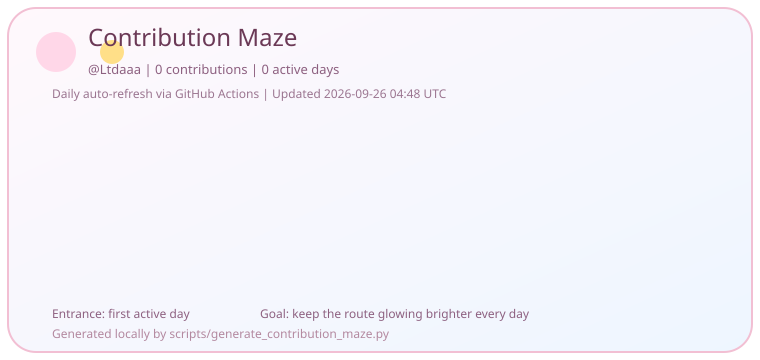



  

  
  
  
  
  

  

<strong>Have a good day!</strong>

  

<table>
  <tr>
    <td width='32%' valign='top'>
      
      <h2>Ltdaaa</h2>
      
这里放你的昵称、设定和一句有氛围感的个人简介。示例：热爱代码、绘图与世界观构筑的二次元开发者，正在把灵感一点点写进现实。

      
<strong>Profile Tips</strong>

      
- 把头像替换成你自己的动漫头像链接或仓库内图片路径。

      
- 简介建议保留 2 到 3 句，GitHub 主页会更清爽。

      
- 如果你有常用标签，也可以在这里补上如 `Frontend`、`AI`、`Design`。

    </td>
    <td width='68%' valign='top'>
      
      
这张迷宫卡片基于 GitHub 贡献日历生成，`GitHub Actions` 会每天自动刷新一次，让路线随着你的活跃度持续发光。

      
<strong>Renderer Note</strong>：由于 GitHub 原生 Markdown 会过滤大部分全局 CSS 和 `iframe` 能力，樱花效果采用 SVG 内嵌动画实现，保持兼容的同时尽量做出整页飘落氛围。

    </td>
  </tr>
</table>

  

## Deployment Guide

### 1. 创建和用户名同名仓库

1. 登录 GitHub，新建一个公开仓库。
2. 仓库名必须和你的用户名完全一致，这里就是 `Ltdaaa`。
3. 把 `output/github-profile-readme-ltdaaa/` 里的全部文件复制到那个仓库根目录，然后推送。

### 2. 开启仓库 GitHub Actions 权限

1. 进入仓库的 `Settings` -> `Actions` -> `General`。
2. 确认允许工作流运行，至少要让仓库内的 GitHub Actions 可以读写仓库内容。
3. 首次推送后，进入 `Actions` 页签手动运行一次 `Update Contribution Maze`，确认 `assets/contribution-maze.svg` 成功生成并提交。

### 3. 替换头像、图片链接、用户名的修改位置

1. 替换头像：修改 `README.md` 里左侧资料卡的 `./assets/avatar-slot.svg`，或者直接把这个 SVG 换成你自己的头像图片路径。
2. 替换风景大图链接：修改文末这张占位图的跳转地址和图片路径。
   当前写法是 ``。
3. 替换用户名：同步修改 `README.md` 中的 `Ltdaaa`、访问量计数器 URL 里的 `username=Ltdaaa`、以及 `.github/workflows/update-contribution-maze.yml` 里的 `PROFILE_USERNAME: Ltdaaa`。
4. 如果你想替换迷宫卡片标题、配色或文案，可编辑 `scripts/generate_contribution_maze.py` 后重新运行一次工作流。

## Landscape Link Placeholder

